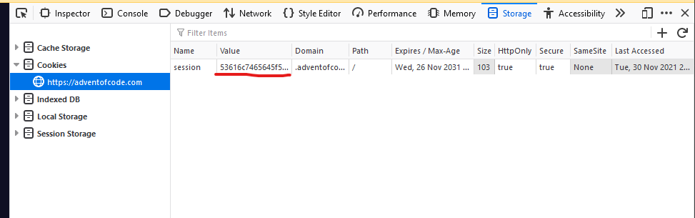

# How to run

## Requirements

- Node.js
- Yarn or npm

## Local development

- Clone repo
- Copy `.env.example` to `.env`
- Fill in the `.env` variables:
  - VITE_LEADERBOARD_ID: get it from url `https://adventofcode.com/2021/leaderboard/private/view/{LEADERBOARD_ID}`
  - SESSION_ID: get this from your session cookie once you log in to adventofcode.com  
    
  - You can leave other variables empty, as they are only useful for deploying
- Run `yarn`
- Run `yarn fetch` - this fetches the leaderboard data from adventofcode api
- Run `yarn dev`
- Visit `http://localhost:3000`
